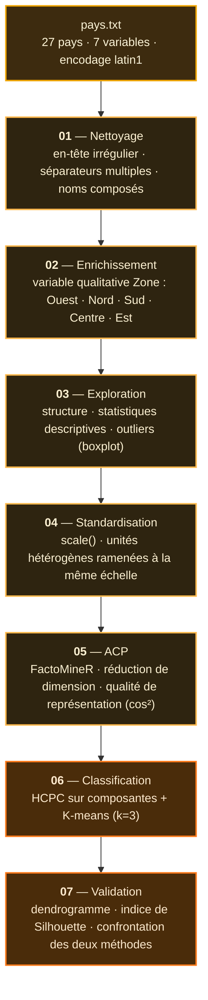

# Analyse Multivariée et Classification de Pays Européens

Analyse en composantes principales et classification non supervisée de
**27 pays européens** sur **7 indicateurs socio-économiques**, avec validation
croisée de deux méthodes de clustering.

## Pipeline



## Variables

| Variable | Description |
|---|---|
| `esp_vie_F` | Espérance de vie des femmes |
| `mort_inf` | Mortalité infantile (‰) |
| `activF` | Taux d'activité féminine (%) |
| `pct_chom` | Taux de chômage (%) |
| `pnb_hb` | PNB par habitant |
| `pct_education` | Dépenses d'éducation (% du PNB) |
| `pct_sante` | Dépenses de santé (% du PNB) |

## Démarche

**Standardisation préalable.** Les variables mélangent des unités
incomparables — un PNB de 50 410 face à un taux de chômage de 2,4. Sans
`scale()`, le PNB écraserait mécaniquement toutes les autres dimensions.

**Deux méthodes de classification confrontées.** La HCPC opère sur les
composantes principales issues de l'ACP, tandis que le K-means travaille
directement sur les données standardisées. La convergence des deux partitions
constitue une validation mutuelle ; leurs divergences signalent les pays en
position frontière.

**Une variable qualitative supplémentaire.** Le découpage géographique (Ouest,
Nord, Sud, Centre, Est) est projeté en illustratif : il ne participe pas à la
construction des axes, ce qui permet de tester si la proximité géographique
recoupe réellement la proximité socio-économique.

## Résultats

**Trois blocs européens se dégagent**, structurés par un fort gradient de
développement :

| Amplitude observée | Minimum | Maximum | Rapport |
|---|---|---|---|
| PNB par habitant | 7 809 (Lettonie) | 50 410 (Luxembourg) | **× 6,5** |
| Espérance de vie F | 64,5 ans (Lettonie) | 77,5 ans (Suède) | 13 ans d'écart |
| Taux de chômage | 2,4% (Luxembourg) | 18,1% (Pologne) | × 7,5 |
| Activité féminine | 22,9% (Malte) | 76,2% (Suède) | × 3,3 |

Les pays baltes (Estonie, Lettonie, Lituanie) se détachent nettement sur
l'ensemble des indicateurs, tandis que le modèle nordique se distingue par
la conjonction d'une activité féminine élevée et de dépenses publiques
d'éducation supérieures.

## Stack

| Package | Usage |
|---|---|
| `FactoMineR` | ACP et classification hiérarchique (HCPC) |
| `factoextra` | Visualisation des facteurs, clusters et silhouette |
| `cluster` | Calcul de l'indice de Silhouette |

## Exécution

```r
install.packages(c("FactoMineR", "factoextra", "cluster"))
source("ScriptDeProjet.R")
```

Le fichier `pays.txt` doit se trouver dans le répertoire de travail.

## Limites

- L'effectif réduit (27 individus) limite la robustesse de la partition ;
  le choix de k = 3 s'appuie sur le dendrogramme et non sur une validation
  systématique de plusieurs valeurs de k.
- Les données constituent une coupe transversale : aucune dimension temporelle
  ne permet d'observer les trajectoires de convergence.
